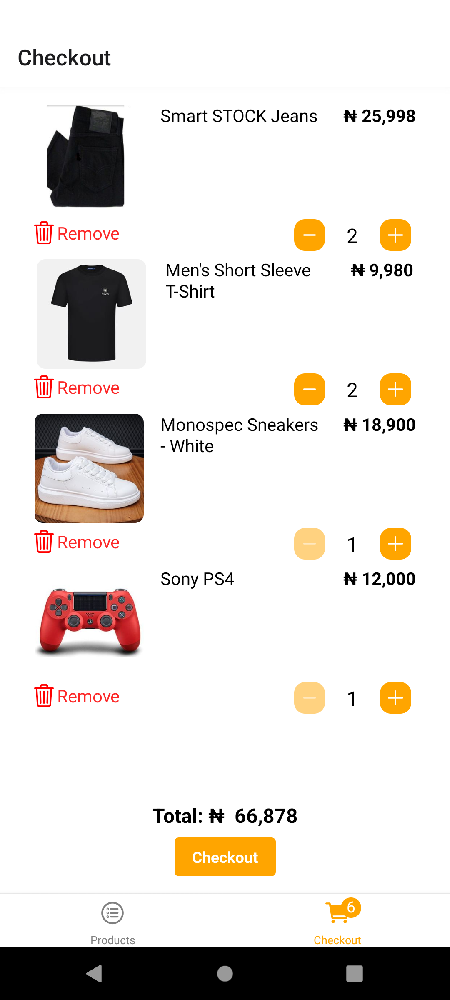
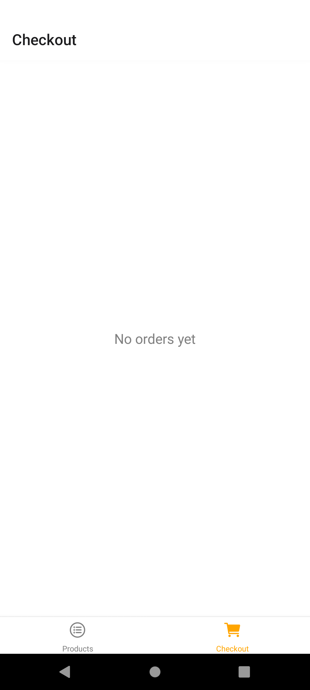
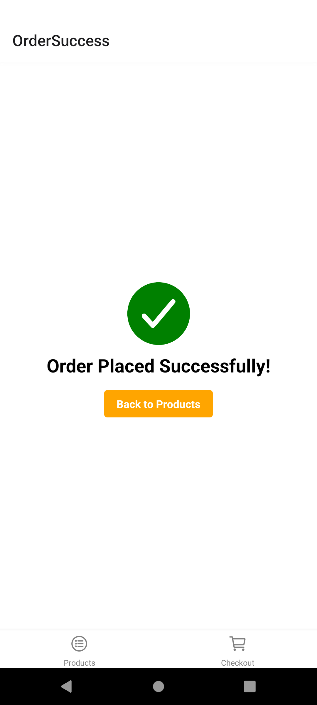

# Simple Shopping App

A clean and intuitive shopping app built with React Native, Expo, and TypeScript. This app showcases a list of products, allows users to add items to their cart, and simulates a checkout process.

## Features

- Browse a list of products
- Add products to cart
- Adjust quantity in cart
- Remove items from cart
- Checkout process
- Clean and responsive UI

## Demo

Try out the app on Appetize.io: [Simple Shopping App Demo](https://appetize.io/app/s6xmwa3tbwy4nejjscmcor54fu)

## Getting Started

These instructions will help you set up the project on your local machine for development and testing purposes.

### Prerequisites

- Node.js (v14 or later)
- npm or yarn
- Expo CLI

### Installation

1. Clone the repository: 
   `https://github.com/Tommzydanz/shopping-app.git`
2. Navigate to the project directory: 
   `cd shopping-app`
3. Install dependencies: `npx expo install`
   or If you're using yarn: `yarn install`
4. Start the Expo development server:
   `npx expo start`
5. Use the `Expo Go app` on your mobile device to scan the QR code from the terminal or run on an emulator.

## Project Structure
shopping-app/
├── src/
│   ├── components/
│   │   ├── cart-item/
│   │   │   ├── CartItem.tsx
│   │   │   └── interface.ts
│   │   └── product-item/
│   │       ├── ProductItem.tsx
│   │       └── interface.ts
│   ├── screens/ 
│   │   ├── Products.tsx
│   │   ├── Checkout.tsx
│   │   └── OrderSuccess.tsx
│   └── data/
│       └── products.ts
├── App.tsx
├── eslintrc.js
├── app.json
├── eas.json
├── package.json
├── tsconfig.json
└── README.md

## Built With

- [React Native](https://reactnative.dev/) - The mobile application framework used
- [Expo](https://expo.dev/) - Development platform for React Native
- [TypeScript](https://www.typescriptlang.org/) - For type-safe code
- [React Navigation](https://reactnavigation.org/) - For navigation between screens

## Authors

- **Tommzydanz** - *Shopping app* - [Tommzydanz](https://github.com/Tommzydanz)

## License

This project is licensed under the MIT License - see the [LICENSE.md](LICENSE.md) file for details

## Acknowledgments

- HNG11 [HNG internship](https://hng.tech/internship)
- Inspiration
- etc
